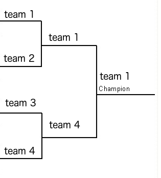

# MatchBracket

## Installation

Run `npm install` to download the dependencies required.

## Development server

Run `ng serve` for a dev server. Navigate to `http://localhost:4200/`. The app will automatically reload if you change any of the source files.

## Context

* Don't use additional DOM manipulation frameworks like jQuery
* Try to limit yourself to 2-3 hours
* Design patterns and thought processes are the primary goals of this test, we wont be evaluating style

## Background
Create a bracketing system which can generically display information about a tournament. Brackets
are typically used to visualize what stage a competition is currently in, and what the current state of the
competition is (what matches have been played and who has won them). An example bracket can be seen here:

## Challenge
Write a component (or set of components) which can visualize data of type `Match` as a single match in a tournament bracket.
The `seedMatches` property on the `Match` interface will be an empty `Array` for the first match in the tournament, with the 
`winner` property holding a reference to the `Team` participating. Matches in the following rounds will contain a reference to 
the seed matches that were played in order to provide players for the current round. The `winner` properties of those seed matches
will hold the participants in that match. Examine the `football-match.stub.ts` file to see the initial state of the source data model that 
will be used to populate the match bracket.

The `Match` interface also contains a property called `matchInfo` which, depending on the sport the bracket is representing, 
could be filled with sport-specific information. In a completed match where a winner is described, display the match information.
We want this bracketing framework to be flexible enough to support any number of sports/games in a scalable way.

The currently supported games are soccer and football. When displaying a soccer match, `matchInfo` will conform to the 
`SoccerInfo` interface, while a football match will conform to `FootballInfo`. While those are the sports currently 
supported, it should be easy to add additional sports in the future. A component for rendering match info for each of these sports
can be found in the games directory along with their interfaces.
